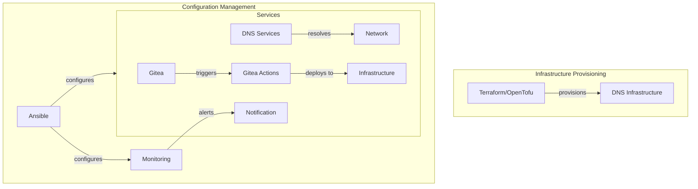

# Homelab Infrastructure

A comprehensive Infrastructure as Code (IaC) solution for managing homelab services using Ansible, Terraform/OpenTofu, and other automation tools.



## Core Components

- **Self-hosted Git** (Gitea with Gitea Act Runners)
- **DNS Management** (Pi-hole, dnsdist)
- **Monitoring** (Disk monitoring, UPS monitoring)
- **Container Management** (Watchtower)
- **Special Purpose** (NVIDIA GPU support, Network UPS Tools)

## Getting Started

This project uses [pkgx](https://pkgx.sh) to manage tool dependencies:

```bash
# Install pkgx if you haven't already
curl -fsS https://pkgx.sh | sh

# Use pkgx to automatically install required tools
./pkgx-deploy.sh
```

## Deployment Options

### Ansible Deployment

For deploying services with Ansible:

```bash
# Deploy with default playbook (infrastructure.yml)
./ansible-pkgx-deploy.sh

# Deploy specific service (this runs ansible/[service-name].yml)
./ansible-pkgx-deploy.sh drone-only

# Use custom options
./ansible-pkgx-deploy.sh --playbook=ansible/specific-playbook.yml --inventory=ansible/custom-inventory.yml
```

### Infrastructure Deployment

For managing DNS infrastructure:

```bash
# Deploy DNS infrastructure
./deploy.sh

# For blue/green DNS deployments
cd dns/pihole
./tofu-ns.sh [blue|green] <tofu commands>
```

## Configuration

Each component requires specific configuration files. Example configurations are provided with `.example` extensions.

### Secrets Management

The project uses [git-crypt](https://github.com/AGWA/git-crypt) to securely store sensitive configuration files in the repository:

- Sensitive files are encrypted using git-crypt
- `.gitattributes` defines which files should be encrypted
- Users need to be added to the git-crypt keyring to access encrypted files
- Example configurations are provided unencrypted with `.example` extensions

### Example Configurations

For Terraform/OpenTofu:

- Backend config: `config.s3.example.tfbackend`
- Variables: `terraform.example.tfvars`

For Ansible:

- Group variables: `group_vars/all.example.yml`
- Host variables: `host_vars/example.com.yml`
- Role variables: `ansible/{service}/vars/main.example.yml`

## Available Playbooks

The project includes dedicated playbooks for various services:

- `infrastructure.yml`: Complete infrastructure deployment
- Service-specific playbooks:
  - `drone-only.yml`
  - `drone-runner-exec-only.yml`
  - `gitea-only.yml`
  - `gitea-act-runner-only.yml`
  - `disk-monitoring-only.yml`
  - `nut-only.yml`
  - `nvidia-gpu-only.yml`
  - `watchtower-only.yml`

> **Note:** The DNS-related components (Pi-hole and dnsdist) are integrated with Terraform/OpenTofu IaC for Proxmox and don't have standalone playbooks.

## CI/CD

Changes to this repository are automatically deployed through Gitea Actions workflows that run the appropriate deployment scripts based on which files have changed.

## Documentation

For more detailed documentation on specific components:

- DNS: See `dns/dns-ha/README.md` and `dns/pihole/README.md`
- Ansible: See `ansible/README.md`
- Individual services: See README files in specific role directories
