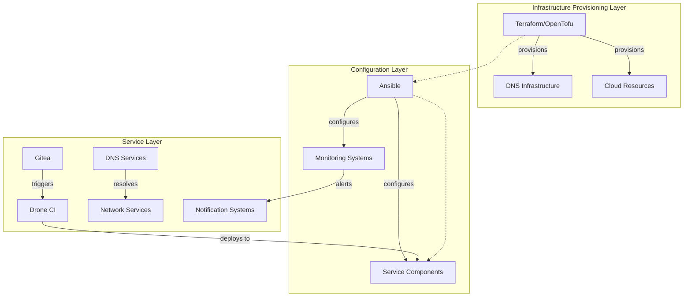
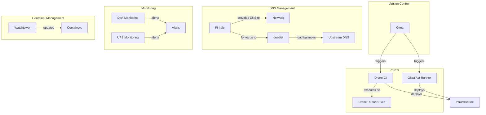

# System Patterns: Homelab Infrastructure

## Architecture Overview

The homelab infrastructure follows a modular, layered architecture that enables independent service deployment while maintaining system cohesion. The architecture is organized according to these principles:

## Key Technical Decisions

### 1. Service Deployment Strategy

**Pattern**: Role-Based Ansible Playbooks

- Each service is defined as an Ansible role with standardized structure
- Multiple deployment methods (standalone playbooks, combined infrastructure playbook)
- Dependency management through Ansible role metadata
- Separation of default configuration and environment-specific variables

**Implementation**:

- Individual service roles: `/ansible/{service-name}/`
- Combined deployment playbooks: `/ansible/{service-name}-only.yml`, `/ansible/infrastructure.yml`
- Deployment scripts: `ansible-deploy.sh`, `pkgx-deploy.sh`

### 2. Configuration Management

**Pattern**: Layered Configuration with Environment Overrides

- Default configurations defined within roles
- Environment-specific overrides in `group_vars` and `host_vars`
- Template-based configuration generation
- Secrets management via encrypted files

**Implementation**:

- Role defaults: `/ansible/{service-name}/defaults/main.yml`
- Host-specific configurations: `/ansible/host_vars/{hostname}.yml`
- Group configurations: `/ansible/group_vars/{group}.yml`

### 3. DNS Architecture

**Pattern**: High-Availability DNS with Ad Blocking

- Primary/secondary DNS server architecture
- DNS filtering via Pi-hole
- Advanced DNS routing via dnsdist
- DNS infrastructure managed via Terraform/OpenTofu

**Implementation**:

- Pi-hole deployment: `/ansible/pihole/`
- dnsdist configuration: `/ansible/dnsdist/`
- DNS infrastructure as code: `/dns/dns-ha/`, `/dns/pihole/`

### 4. CI/CD Pipeline

**Pattern**: Self-hosted Git + CI/CD

- Gitea for Git repository hosting
- Drone CI for pipeline execution
- Multiple runner types for different workload requirements
- Gitea Act runners for GitHub Actions compatibility

**Implementation**:

- Gitea deployment: `/ansible/gitea/`
- Drone server: `/ansible/drone/`
- Drone runners: `/ansible/drone-runner-exec/`
- Gitea Act runners: `/ansible/gitea-act-runner/`

### 5. Monitoring Solutions

**Pattern**: Component-Specific Monitoring with Centralized Dashboards

- Specialized monitoring for specific components (disks, UPS)
- Metrics collection via Telegraf
- Visualization via Grafana dashboards
- Integration with notification systems

**Implementation**:

- Disk monitoring: `/ansible/disk-monitoring/`
- UPS monitoring: `/ups-monitoring/`

## Component Relationships

## Critical Implementation Paths

### Service Deployment Flow

1. **Infrastructure Definition**

   - Define service configuration in Ansible roles
   - Set environment-specific variables
   - Prepare templates and tasks

2. **Deployment Execution**

   - Execute `ansible-deploy.sh` with appropriate playbook
   - Ansible applies configuration to target hosts
   - Services are installed, configured and started

3. **Verification**
   - Service health checks
   - Monitoring integration
   - Documentation updates

### DNS Resolution Path

1. **Client Request**

   - Client device queries local Pi-hole instance
   - Pi-hole filters request against blocklists

2. **Request Forwarding**

   - Pi-hole forwards to dnsdist for resolution
   - dnsdist applies routing rules and load balancing

3. **Response Path**
   - DNS response returns through dnsdist
   - Pi-hole caches response for future queries
   - Response delivered to client

### CI/CD Workflow

1. **Code Change**

   - Push to Gitea repository
   - Webhook triggers Drone CI or Gitea Act Runner

2. **Pipeline Execution**

   - Runner executes defined pipeline steps
   - Tests run against changes
   - Artifacts built if required

3. **Deployment**
   - Successful pipeline triggers deployment
   - Ansible playbooks apply changes to infrastructure
   - Verification steps confirm successful deployment

## Application of Design Patterns

1. **Infrastructure as Code** - Everything defined as code in version-controlled repositories
2. **Role-Based Configuration** - Modular components with clear responsibilities
3. **Configuration Templates** - Dynamic configuration generation from templates and variables
4. **High Availability Pairs** - Critical services deployed in redundant configurations
5. **Pipeline-Driven Deployments** - Changes deployed through automated pipelines
6. **Monitoring by Default** - All services integrate with monitoring systems
7. **Container-Based Services** - Services isolated in containers where appropriate
8. **Automated Updates** - Watchtower manages container updates automatically
