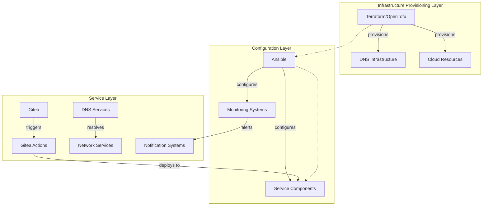
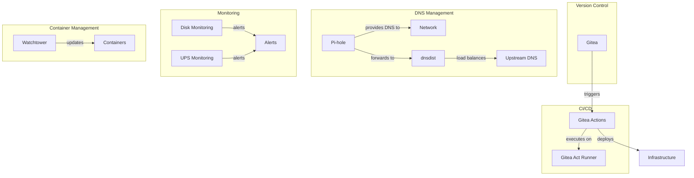

# System Patterns: Homelab Infrastructure

## Architecture Overview

The homelab infrastructure follows a modular, layered architecture that enables independent service deployment while maintaining system cohesion. The architecture is organized according to these principles:



## Key Technical Decisions

### 1. Service Deployment Strategy

**Pattern**: Role-Based Ansible Playbooks

- Each service is defined as an Ansible role with standardized structure
- Multiple deployment methods (standalone playbooks, combined infrastructure playbook)
- Dependency management through Ansible role metadata
- Separation of default configuration and environment-specific variables

**Implementation**:

- Individual service roles: `/ansible/{service-name}/`
- Combined deployment playbooks: `/ansible/{service-name}-only.yml`, `/ansible/infrastructure.yml`
- Deployment scripts: `ansible-deploy.sh`, `pkgx-deploy.sh`

### 2. Configuration Management

**Pattern**: Layered Configuration with Environment Overrides

- Default configurations defined within roles
- Environment-specific overrides in `group_vars` and `host_vars`
- Template-based configuration generation
- Secrets management via encrypted files

**Implementation**:

- Role defaults: `/ansible/{service-name}/defaults/main.yml`
- Host-specific configurations: `/ansible/host_vars/{hostname}.yml`
- Group configurations: `/ansible/group_vars/{group}.yml`

### 3. DNS Architecture

**Pattern**: High-Availability DNS with Ad Blocking

- Primary/secondary DNS server architecture
- DNS filtering via Pi-hole
- Advanced DNS routing via dnsdist
- DNS infrastructure managed via Terraform/OpenTofu

**Implementation**:

- Pi-hole deployment: `/ansible/pihole/`
- dnsdist configuration: `/ansible/dnsdist/`
- DNS infrastructure as code: `/dns/dns-ha/`, `/dns/pihole/`

### 4. CI/CD Pipeline

**Pattern**: Self-hosted Git + CI/CD

- Gitea for Git repository hosting
- Gitea Actions for pipeline execution
- Multiple runner types for different workload requirements
- Gitea Act runners for GitHub Actions compatibility
- Workflow files for different deployment types

**Implementation**:

- Gitea deployment: `/ansible/gitea/`
- Workflow files: `.gitea/workflows/*.yml`
- Gitea Act runners: `/ansible/gitea-act-runner/`
- Specialized workflows for:
  - Ansible deployments: `.gitea/workflows/ansible-deploy.yml`
  - DNS infrastructure: `.gitea/workflows/dns-infrastructure-deploy.yml`

### 5. Monitoring Solutions

**Pattern**: Component-Specific Monitoring with Centralized Dashboards

- Specialized monitoring for specific components (disks, UPS)
- Metrics collection via Telegraf
- Visualization via Grafana dashboards
- Integration with notification systems
- Role-based architecture with standardized structure
- Separation of monitoring configuration and dashboard creation tools

**Implementation**:

- Disk monitoring: `/ansible/disk-monitoring/` (role-based architecture)
- UPS monitoring: `/ups-monitoring/`
- Dashboard tools: `/ansible/tools/grafana/` (for creating and maintaining dashboards)

## Component Relationships



## Critical Implementation Paths

### Service Deployment Flow

1. **Infrastructure Definition**

   - Define service configuration in Ansible roles
   - Set environment-specific variables
   - Prepare templates and tasks

2. **Deployment Execution**

   - Execute `ansible-deploy.sh` with appropriate playbook
   - Ansible applies configuration to target hosts
   - Services are installed, configured and started

3. **Verification**
   - Service health checks
   - Monitoring integration
   - Documentation updates

### DNS Resolution Path

1. **Client Request**

   - Client device queries local Pi-hole instance
   - Pi-hole filters request against blocklists

2. **Request Forwarding**

   - Pi-hole forwards to dnsdist for resolution
   - dnsdist applies routing rules and load balancing

3. **Response Path**
   - DNS response returns through dnsdist
   - Pi-hole caches response for future queries
   - Response delivered to client

### CI/CD Workflow

1. **Code Change**

   - Push to Gitea repository
   - Webhook triggers Gitea Actions workflows

2. **Pipeline Execution**

   - Gitea Act Runner executes defined workflow steps
   - Path-based filtering ensures only relevant workflows run
   - Tests run against changes
   - Artifacts built if required

3. **Deployment**
   - Successful workflow triggers deployment
   - Ansible playbooks or deployment scripts apply changes to infrastructure
   - Verification steps confirm successful deployment

## Development Standards

### Code Style Guidelines

1. **Infrastructure-as-Code Best Practices**:

   - Follow established IaC patterns and practices
   - Maintain consistent structure across similar resources
   - Use descriptive variable names (e.g., `nvidia_driver_version`, `install_btop`)

2. **Feature Management**:

   - Use consistent feature toggles with boolean variables
   - Implement conditional execution based on these variables

3. **Documentation and Readability**:

   - Include task comments describing purpose
   - Maintain consistent indentation in YAML files (2 spaces)
   - Document complex logic and decision points

4. **Error Handling**:

   - Handle errors with retries and proper ignore_errors handling
   - Register command outputs for validation and debugging

5. **Modularity**:

   - Organize tasks into modular files with clear responsibilities
   - Use templates (.j2 files) for configuration generation
   - Break complex tasks into smaller, focused tasks

6. **Template Generation**:

   - When creating templates for YAML files (especially docker-compose.yml), use list building in Jinja2 to ensure proper indentation and avoid whitespace issues:

   ```jinja
   environment:
     # Build environment variables list to ensure consistent formatting
   
   
   
   
   
         - {{ var }}
   
   ```

7. **Configuration Management**:

   - When adding new variables to example files (e.g., `main.example.yml`), always update the corresponding actual configuration files (e.g., `main.yml`) to maintain consistency
   - When adding new features or tasks, always add corresponding tests in the test playbook (e.g., `test-playbook.yml`) to verify the installation and functionality

8. **Service Management**:

   - When updating configuration files for services, ensure the service is restarted to apply the new configuration:

   ```yaml
   - name: Update service configuration
     ansible.builtin.template:
       src: config-template.j2
       dest: /path/to/config
     register: config_updated

   - name: Restart service if configuration changed
     ansible.builtin.systemd:
       name: service-name
       state: restarted
     when: config_updated is changed
   ```

9. **Service Validation**:
   - For services that may take time to start (e.g., Docker containers), use Ansible's retry and until mechanisms instead of fixed delays:
   ```yaml
   - name: Wait for service to start
     ansible.builtin.shell: docker ps | grep service-name
     register: service_result
     changed_when: false
     ignore_errors: true
     retries: 15 # Number of attempts
     delay: 4 # Seconds between retries
     until: service_result.rc == 0
     when: install_service | bool
   ```

## Code Quality Tools

### Pre-commit Hooks

**Pattern**: Automated Quality Checks on Commit

- Pre-commit hooks run automatically when committing changes
- Different hooks perform specific checks based on file types
- Prevents committing code that doesn't meet quality standards
- Provides immediate feedback to developers

**Implementation**:

- Repository-level configuration in `.pre-commit-config.yaml`
- OpenTofu/Terraform formatting with `tofu fmt` on `.tf` files
- Hooks can be added or modified as project requirements evolve

## Application of Design Patterns

1. **Infrastructure as Code** - Everything defined as code in version-controlled repositories
2. **Role-Based Configuration** - Modular components with clear responsibilities
3. **Configuration Templates** - Dynamic configuration generation from templates and variables
4. **High Availability Pairs** - Critical services deployed in redundant configurations
5. **Pipeline-Driven Deployments** - Changes deployed through automated pipelines
6. **Monitoring by Default** - All services integrate with monitoring systems
7. **Container-Based Services** - Services isolated in containers where appropriate
8. **Automated Updates** - Watchtower manages container updates automatically
9. **Adaptive Configuration** - Services configure themselves based on host capabilities (e.g., IPv6 support)
10. **Code Quality Automation** - Tools like pre-commit ensure consistent code formatting and quality

## Network Configuration Patterns

### IPv6 Support

**Pattern**: Conditional IPv6 Network Configuration

- Docker networks conditionally enable IPv6 based on host capabilities
- Templates use Ansible facts to detect IPv6 support on the host
- Network configuration is only applied when supported
- Services attach to IPv6-enabled networks when available

**Implementation**:

```yaml
# Example from watchtower-docker-compose.yml.j2

networks:
  net:
    driver: bridge
    enable_ipv6: true


services:
  service_name:
    # service configuration
    
    networks:
      - net
    
```

This pattern ensures that:

1. IPv6 is only enabled when the host has IPv6 addresses configured
2. No configuration changes are needed for existing deployments
3. Services fall back to standard Docker networking on hosts without IPv6
4. The same template works in both IPv6 and IPv4-only environments

## API Integration Patterns

### Grafana Alerting API Guidelines

**Pattern**: Standardized Grafana Alert Management

- **Permissions Handling**: Grafana OSS requires Admin role for alert management (no granular RBAC like Enterprise)
- **Required Fields Structure**: Alert rules MUST have:
  - `folderUID` (cannot be empty)
  - Proper `condition` reference
  - Correct datasource UIDs

**Implementation**:

1. **API Structure**:

   - Use `/api/v1/provisioning/alert-rules` for creation
   - Follow proper InfluxDB + Expression query format

2. **Notification Policies**:

   - Use `object_matchers` format (not old `matcher` format)
   - Use PUT method for updates to `/api/v1/provisioning/policies`

3. **Error Handling**:

   - Always include fallback to export JSON files when API permissions fail

4. **Query Formatting**:

   - Use visual query builder format in alert rules, not raw SQL format
   - Use `__expr__` UID for threshold conditions with `type: "threshold"`

5. **Integration Approach**:
   - Route alerts to existing contact points like `autogen-contact-point-default` using object_matchers
   - Test API permissions before attempting rule creation to provide better user experience
